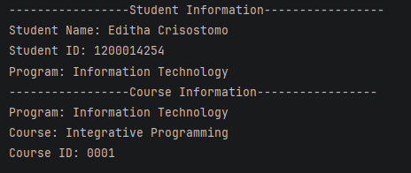

# Header 1
## Header 2
### Header 3

---
This is a sample **markdown**

**bold**

---

List 
- list 1
- list 2

1. num 1
2. num 2
3. num 3

[Name](Link Here)

Links: [Click Here](https://github.com/EOMCrisostomo/OOP-EnrollmentSystem)

Image: 

---

for Output

---
# TITLE
---
**Author**

**1. Description**

!(ScreenShot)[]