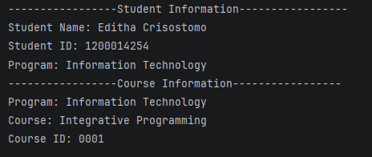
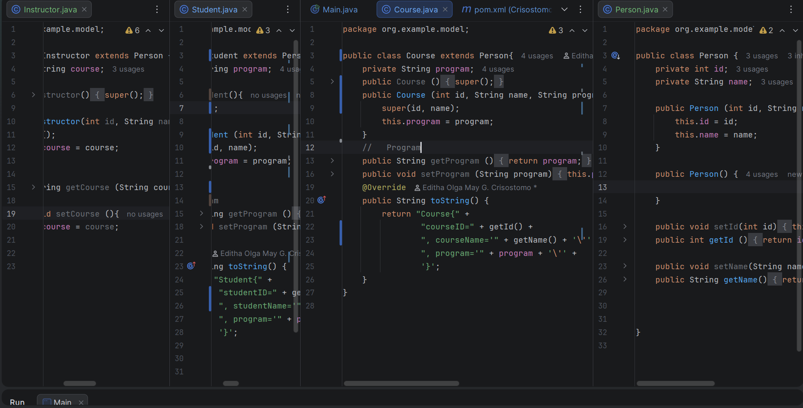
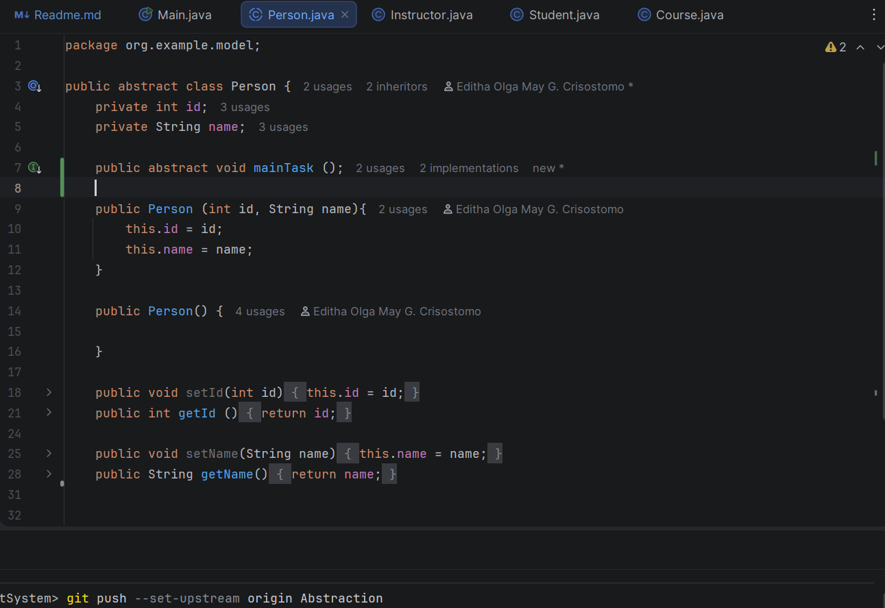

# OOP Enrollment System
---
**Author: Editha Crisostomo**

**1. This is a simple Enrollment System that uses Encapsulation**

# OOP Enrollment System 1.1
--
**Author: Editha Crisostomo**

**1. Added Inheritance**

# OOP Enrollment System 1.2
--
**Author: Editha Crisostomo**

**1. Added Abstraction to Person**

